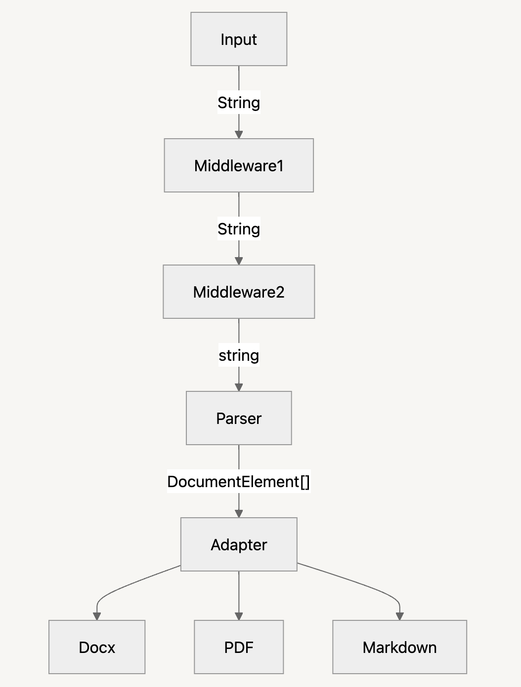

[](https://www.npmjs.com/package/html-to-document)
[](https://github.com/ChipiKaf/html-to-document/actions)
[](LICENSE)

# html‑to‑document

Are you looking for a lightweight, extensible way to convert from HTML to any document format?

> **Convert any HTML into production‑ready documents — DOCX today, PDF today, XLSX tomorrow.**

`html‑to‑document` parses HTML into an intermediate, format‑agnostic tree and then feeds that tree to **adapters** (e.g. DOCX, PDF).  
Write HTML → get Word, PDFs, spreadsheets, and more — all with one unified TypeScript API.

---

## How It Works

Below is a high-level overview of the conversion pipeline. The library processes the HTML input through optional middleware steps, parses it into a structured intermediate representation, and then delegates to an adapter to generate the desired output format.



The stages are:

- **Input**: Raw HTML input as a string.  
- **Middleware**: One or more middleware functions can inspect or transform the HTML string before parsing (e.g., sanitization, custom tags).  
- **Parser**: Converts the (possibly modified) HTML string into an array of `DocumentElement` objects, representing a structured AST.  
- **Adapter**: Takes the parsed `DocumentElement[]` and renders it into the target format (e.g., DOCX, PDF, Markdown) via a registered adapter.

---


## ✨ Key Features
| Feature | Description |
|---------|-------------|
| **Format‑agnostic core** | Converts HTML into a reusable `DocumentElement[]` structure |
| **DOCX adapter (built‑in)** | Powered by [`docx`](https://npmjs.com/package/docx) with rich style support |
| **Pluggable adapters** | Create and add your own adapter for PDF, XLSX, Markdown, etc. |
| **Style mapping engine** | Define your own css mappings for the adapters and set per‑format defaults |
| **Custom tag handlers** | Override or extend how any HTML tag is parsed |
| **Middleware pipeline** | Transform or sanitise HTML before parsing |

---

## 📦 Installation
```bash
npm install html-to-document
```

---

## 🚀 Quick Start
```ts
import { init, DocxAdapter } from 'html-to-document';
import fs from 'fs';

const converter = init({
  adapters: {
    register: [
      { format: 'docx', adapter: DocxAdapter },
    ],
  },
});

const html = '<h1>Hello World</h1>';
const buffer = await converter.convert(html, 'docx');   // ↩️ Buffer in Node / Blob in browser
fs.writeFileSync('output.docx', buffer);
```

### Registering adapters manually  

```ts
import { init } from 'html-to-document';
// DOCX adapter is included. For PDF support:
// npm i html-to-document-adapter-pdf
// Docs: https://www.npmjs.com/package/html-to-document-adapter-pdf
import { DocxAdapter } from 'html-to-document-adapter-docx';

const converter = init({
  adapters: {
    register: [
      { format: 'docx', adapter: DocxAdapter },
    ],
  },
});
```

> **Tip:** you can bundle multiple adapters:
> ```ts
> register: [
>   { format: 'docx', adapter: DocxAdapter },
>   { format: 'pdf',  adapter: PdfAdapter },
> ]
> // To install PDF support, run:
> // npm i html-to-document-adapter-pdf
> // See docs: https://www.npmjs.com/package/html-to-document-adapter-pdf
> ```

The rest of the API stays the same—`convert(html, 'docx')`, `convert(html, 'pdf')`, etc.

Need just the parsed structure?
```ts
const elements = await converter.parse('<p>Some HTML</p>');
console.log(elements); // => DocumentElement[]
```

---

## 📚 Documentation & Demo
| Resource | Link |
|----------|------|
| **Full Docs** | https://html-to-document.vercel.app/ |
| **Live Demo (TinyMCE)** | https://html-to-document-demo.vercel.app |

---

## 🛠 Extending
- **Style mappings:** fine‑tune CSS → DOCX/PDF with `StyleMapper`
- **Tag handlers:** intercept `<custom-tag>` → your own `DocumentElement`
- **Custom adapters:** implement `IDocumentConverter` to target new formats

### Creating Your Own Adapter

To create a new adapter from scratch in your own project:
1. Install the core types:
   ```bash
   npm install html-to-document-core
   ```
   This package contains the necessary interfaces and type definitions like `DocumentElement`, `StyleMapper`, and `IDocumentConverter`.

2. Implement your adapter based on the documentation here:  
   [Custom Converters Guide](https://html-to-document.vercel.app/docs/api/converters)

See the [Extensibility Guide](https://html-to-document.vercel.app/docs/api/converters).

---

## 🧑‍💻 Contributing
Contributions are welcome!  
Please read [CONTRIBUTING.md](CONTRIBUTING.md) and follow the [Code of Conduct](CODE_OF_CONDUCT.md).

---

## 📝 Changelog
All notable changes are documented in [CHANGELOG.md](CHANGELOG.md).

---

## 📄 License
[ISC](LICENSE) — a permissive, MIT‑style license that allows free use, modification, and distribution without requiring permission.